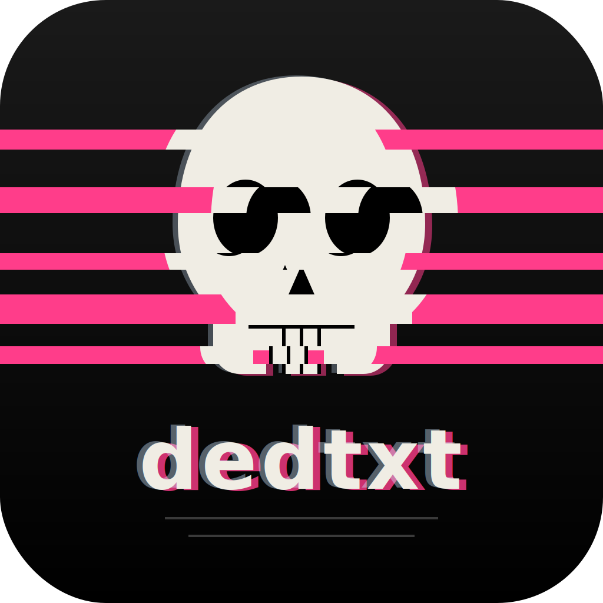

<p align="center">
  
</p>

# dedtxt

A dead simple plain-text editor.

> "because everything sucked for this sort of thing"

A bit like TextEdit or Notepad, but even simpler and with fewer features.
No hidden text. No formatting. No settings to fiddle with. Just a textarea
and your file. Raw bytes in, raw bytes out — UTF-8 by default, no BOM, no
line-ending munging. If the tab dies with unsaved text, the next visit
offers to restore it.

Two targets, same code:

- **Web** at <https://dedtxt.app/> — the editor itself, installable as a PWA
  from any modern browser (including iOS and Android via "Add to Home Screen").
  **This is the shipping target.**
- **Desktop** — macOS / Windows / Linux native via [Tauri 2](https://v2.tauri.app/).
  **Native installer builds are paused for now** in favor of the PWA; the code,
  Rust tests, and CI are kept current so they can be revived later (see
  [FUTURE.md](./FUTURE.md) and [CHANGELOG.md](./CHANGELOG.md)).

## Requirements

- **Node 20+** (see `.nvmrc`)
- **Rust** stable (`rustup install stable`) for desktop builds. Web-only
  development doesn't need Rust.

## Run from source

```sh
npm install
npm start                 # Tauri dev window (Rust toolchain required)
npm run serve:web         # Web build at http://127.0.0.1:5173
npm test                  # JS unit tests (node:test, zero deps)
```

Rust unit tests:

```sh
cargo test --manifest-path src-tauri/Cargo.toml
```

## Project structure

```
src/                      The app itself — shared by every platform
  index.html              Single textarea + first-visit welcome dialog
  renderer.js             Editor logic; talks only to platform/
  welcome.js              First-visit dialog (mobile detection, shortcut labels)
  platform/
    index.js              Detects runtime, picks an implementation
    tauri.js              Bridges to Rust via window.__TAURI__ globals
    web.js                File System Access API + download fallback
  sw.js                   Service worker for offline web
  manifest.webmanifest    PWA manifest
src-tauri/                Rust crate — the desktop "main process"
  Cargo.toml              Crate manifest
  tauri.conf.json         Window + bundle config
  src/lib.rs              Menus, dialogs, file I/O, OS events (+ unit tests)
  icons/                  Generated platform icons (32x32.png, icon.icns, etc.)
build/                    Icon source (icon.svg) + master icon outputs
scripts/                  Build scripts (web, icons)
test/                     JS unit tests (node:test)
CNAME                     dedtxt.app custom-domain claim for gh-pages
```

The renderer is platform-agnostic: it imports `platform/index.js`, which
returns one of two modules with the same interface (`tauri.js` for the
desktop app, `web.js` for the PWA). Adding a new platform means writing a
new module and teaching `platform/index.js` how to detect it.

## Build desktop installers (paused)

> **Native desktop builds are deprecated for now** — the PWA is the shipping
> target. The tooling below still works locally and the Rust code stays tested
> in CI (the `desktop-check` job), but no installers are auto-built or released.
> See [FUTURE.md](./FUTURE.md) to revive them.

Each OS builds its own installers locally (Tauri uses the host platform's
build tooling — codesign, nsis, dpkg, etc.):

```sh
npm run build:mac         # .dmg + .app.tar.gz (host arch)
npm run build:win         # .msi + NSIS .exe
npm run build:linux       # AppImage + .deb + .rpm
```

Outputs go to `src-tauri/target/release/bundle/`. The GitHub Actions `desktop`
+ `release` jobs that built all three OSes on a `v*` tag are currently disabled
(`if: ${{ false }}`); re-enable them (and restore the tag trigger) to ship
installers again.

## Build the web app

```sh
npm run build:web         # produces dist-web/
npm run serve:web         # serve dist-web/ at http://127.0.0.1:5173
```

`dist-web/` is a static site — drop it on any web host. The editor lives at
the root; `dist-web/app/` is a single-page redirect kept around for the
legacy `dedtxt.app/app/` bookmark.

Pushes to `main` redeploy the site to the `gh-pages` branch automatically
via GitHub Actions; the site lives at <https://dedtxt.app/>.

## Icon

The app icon lives at `build/icon.svg`. Edit it, then run:

```sh
npm run gen:icons         # regenerates Tauri, PWA, and macOS/Windows icon sets
```

## Keys

| Action            | macOS        | Win/Linux  |
| ----------------- | ------------ | ---------- |
| New               | `Cmd + N`    | `Ctrl + N` |
| Open              | `Cmd + O`    | `Ctrl + O` |
| Save              | `Cmd + S`    | `Ctrl + S` |
| Find              | `Cmd + F`    | `Ctrl + F` |
| Toggle welcome    | `Esc`        | `Esc`      |

Drop a file onto the window to open it. The OS "Open with…" menu lists
dedtxt for txt/md/log/json/csv/ini/yml/yaml/xml.

## Save behavior

There's one Save, not Save / Save As. Open a different file and Save targets
the new one — there is no "save as a different file" path. The save dialog is
always the browser's own; dedtxt never stacks its own filename prompt on top.
A fresh buffer defaults to `untitled.txt`, and any extension you type is kept
(`notes.md` stays `notes.md`).

The tab title is bare "dedtxt" until you've actually opened or saved a real
file; after that it's `<name> — dedtxt` when clean and `• <name> • — dedtxt`
when there are unsaved changes (the dirty bullets flank the filename so the
state survives heavy title truncation by the OS window chrome).

**Chromium browsers** (Chrome, Edge, Brave, Arc, Opera) implement the File
System Access API, so opened files have a real writable handle and re-saves
are silent. The native save picker only appears the first time you save an
unnamed buffer.

**Firefox, Safari, and every iOS browser** lack the File System Access API —
there's no JS path to write to a real file on disk, so each save triggers a
download instead. Depending on your browser settings that either lands in your
Downloads folder under the current name or shows the browser's own "where to
save?" dialog. For native-like silent save, use a Chromium browser.

## Welcome dialog

Shown automatically once per browser / install. After you dismiss it,
the auto-open never fires again — not even after a version bump. To
re-open: click the icon in the top-right corner of the editor, or press
`Esc`. Pressing `Esc` again (or clicking outside the card, or typing any
character) closes it.

## Updates

dedtxt keeps itself current — no manual re-download.

**Web** (dedtxt.app) — a new deploy is picked up by the service worker in the
background. Once the fresh assets are cached, the welcome dialog surfaces an
"A new version is ready" notice; clicking it reloads into the new version.

**Desktop** *(paused as of rc.59 — no new installers ship right now)* — on launch the app asks dedtxt.app whether a newer web layer has
shipped. If the installed build can run it, the welcome dialog offers "Click
here to update": the new files are downloaded, each checked against a `sha256`
in the published manifest, then swapped in place (with a progress bar) and the
window reloads — no reinstall, and local state (like the dismissed-welcome
flag) carries over. If a release needs a newer *native* shell than you have
installed, it points you to the Releases page for a fresh installer instead.

## Contributing & history

- [CONTRIBUTING.md](./CONTRIBUTING.md) — dev setup, the PR checklist, and the
  "dead simple" non-goals.
- [CHANGELOG.md](./CHANGELOG.md) — release history (the single source of truth).
- [FUTURE.md](./FUTURE.md) — the short list of ideas worth keeping around.

Bugs and ideas are welcome via the GitHub issue templates. The app's about
popup (click the icon, top-right) also has donation links if you'd like to
support the project.

## License

ISC. See [LICENSE](./LICENSE).
